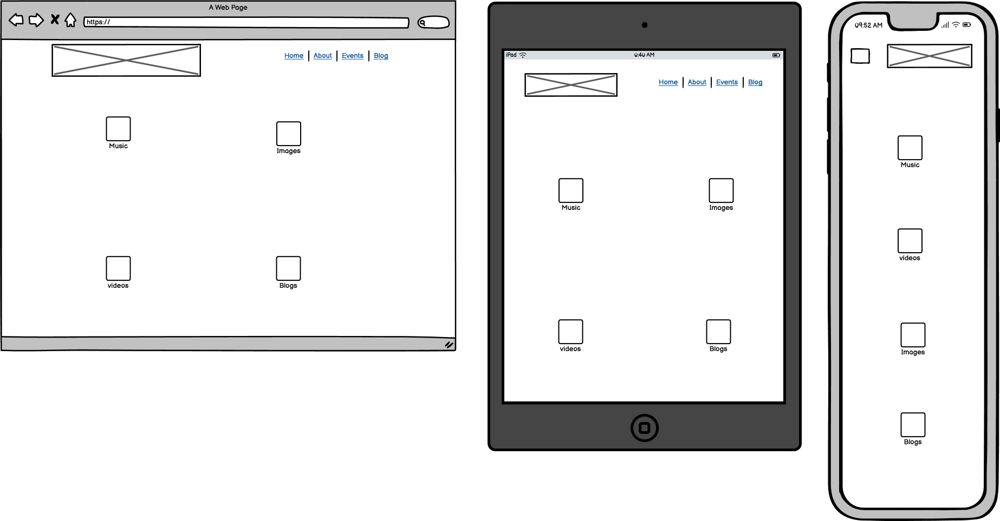
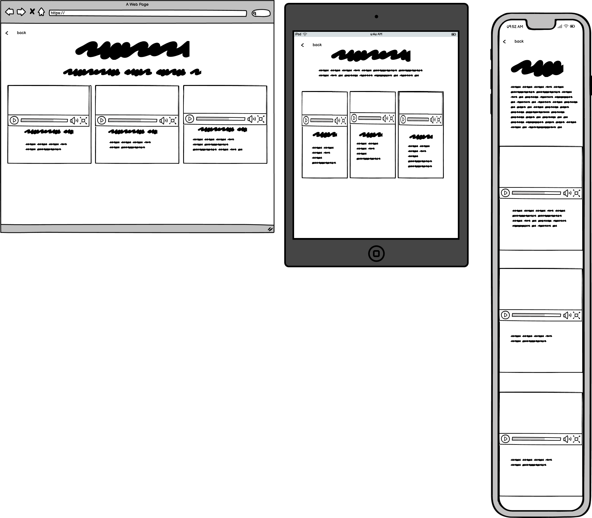

# Da Big Homie | Community Sounds & Events
(Developer: Leon Freeman)

[Live webpage](https://leon4721.github.io/project-one/)

## Table of Content

1. [Project Goals](#project-goals)
    1. [User Goals](#user-goals)
    2. [Site Owner Goals](#site-owner-goals)
2. [User Experience](#user-experience)
    1. [Target Audience](#target-audience)
    2. [User Requrements and Expectations](#user-requrements-and-expectations)
    3. [User Stories](#user-stories)
3. [Design](#design)
    1. [Design Choices](#design-choices)
    2. [Colour](#colours)
    3. [Fonts](#fonts)
    4. [Structure](#structure)
    5. [Wireframes](#wireframes)
4. [Technologies Used](#technologies-used)
    1. [Languages](#languages)
    2. [Frameworks & Tools](#frameworks-&-tools)
5. [Features](#features)
6. [Testing](#validation)
    1. [HTML Validation](#HTML-validation)
    2. [CSS Validation](#CSS-validation)
    3. [Accessibility](#accessibility)
    4. [Performance](#performance)
    5. [Device testing](#performing-tests-on-various-devices)
    6. [Browser compatibility](#browser-compatability)
    7. [Testing user stories](#testing-user-stories)
7. [Bugs](#Bugs)
8. [Deployment](#deployment)
9. [Credits](#credits)
10. [Acknowledgements](#acknowledgements)
## Project Goals

### User Goals

- Discover local urban artists and their work  
- Listen to music, browse images, and watch educational videos from featured or seleteced artists. 
- Easily contact the team to collaborate or submit work  
- read well cureted literartue regaring  specififc or relatign topics 
- find online or local event to showcase my work
- book or purchse tickets  for shows with minimal steps

### Site Owner Goals

- Increase visibility and engagement for local artists  
- Promote local or online events and multimedia content
- Streamline event registration and attendee data collection
- Make it easy for users such as artists to connect, submit content, and get involved  
- Maintain clear branding and an inviting, community-driven aesthetic  

---

## User Experience

### Target Audience

- Urban music fans and event-goers
- Aspiring and established local artists (musicians, dancers, visual artists, etc.)
- Event organizers and promoters
- Anyone interested in hip-hop, diaspora culture, and community events

### User Requirements & Expectations

- simple Intuitive navigation 
- Fast access to music, videos, galleries, and blog content
- Clear event calendar and RSVP/ticket features
- Simple, mobile-friendly contact forms
- Responsive layout with visually engaging design on all devices

### User Stories

#### First-time User 
1. As a first time user, I want see upcoming event venues so that I know where or when Big Homie shows are located.
2. As a first time user, I want to know ticket price ranges on each event card so that I can decide which shows fit my budget.
3. As a first-time user, I want to sample audio, images, and video so that I get a feel for what to expect at the scene.
4. As a first time user, I want to get a feel of what to expect in term the "mission" so that I can learn about the Big Homie’s ideology through community story and context.

#### Returning User
5. As a returning user,I want to control playback (play/pause/skip) inline while browsing so that my listening isn’t interrupted.
6. As a returnign user, I want to use the Contact form so that I can quickly send feedback or collab requests
7. As a returning user, I want to use the Contact section with a map integration so that I can quickly see our where the venue is location.
8. As a returning user, I want to replay tracks I enjoyed on demand aswell as download the Music so that I can listen to it when ever wherver (offline)

#### Site Owner 
13. As the site owner, I want to update hero slider images, captions, and links so that I can keep the homepage spotlight fresh.
14. As the site owner, I want users to get to know the ideology of what we stand for
15. as the site owner, I want to create natural engagem,ent either online or local through grass roots engaments and comopetiton 
16. As the site owner, I want the users to be able to submit content to be curated and accesed before competaions or artist spots 

| As a…            | I want to…                                             | So that I can…                                   |
|------------------|--------------------------------------------------------|--------------------------------------------------|
| New Visitor      | See upcoming events and RSVP or buy tickets            | Attend local shows and connect with the scene    |
| Artist           | Submit my music or register to perform                 | Get exposure and collaborate                     |
| Event Organizer  | Promote my event and handle guest registrations        | Reach more fans and streamline attendance        |
| Fan              | Listen to new tracks and browse images/videos          | Discover fresh talent in my community            |
| Any User         | Contact the team for info or collaborations            | Get quick responses and join the movement        |

---

## Design

### Design Choices

- the website ws desgine with a 90s hip-hop vibe with a gritty, urban palette: burnt orange (#FB621C),
 and moody purple (#410547).smokey backgorunds , pixel fonts, and graffiti-inspired layouts create a raw, nostalgic feel. 
- Built for edge and nostalgia—like a mixtape in website form
- Each main page features a distinct hero section (carousel, video, banner)
- Modal and carousel interactions reinforce modern, dynamic feel

### Colour Scheme

- Rich dark backgrounds (#000, #111) for immersive vibe
- Accent colors drawn from cover art and background
- High contrast for all buttons/text over video

### Fonts
Press Start 2P with cursive as a fallback is used everywhere ( headings, body text) to reinforce Big Homie’s retro, underground mixtape vibe.
Its blocky, pixelated forms echo classic arcade type and street-art stencil lettering while remaining legible at all sizes.

### Structure

The site follows a familiar, easy-to-learn layout: a left-aligned logo in the navbar, right-aligned links that collapse into a hamburger menu on mobile, and five main pages:

# Home (index.html)
with a Hero banner/slider spotlighting featured art peices.
Quick links to the events section.
# About (about.html, modal)
In-page overlay with Big Homie’s mission, community history, and ethos.
# Media Hub (media.html)
Cards linking to four sub-sections:
-Music (music.html): Track cards with cover art and inline players
-Gallery (gallery.html): Full-screen, swipeable image carousel
-Video (video.html): Responsive video cards with embeds
-Blogz (blogz.html): Teaser cards that open full articles in a modal
# events (events.html)
 -Event cards with “Register” or “Buy Tickets” buttons
 -Pop-up modal forms for attendee and artist registration
# contact (contact.html)
-Multi-type inquiry form (general, collab, submission)
-Embedded Google Map showing the venue location
 

- **index.html**: Home/landing, hero slider, 
- **about.html**: Community story, mission, and call to action
- **media.html**: Grid links to music, gallery, video, and blogz
- **music.html**: Track cards with player and cover art
- **gallery.html**: Image carousel, full-screen responsive
- **video.html**: Video cards, responsive YouTube embeds
- **blogz.html**: Article previews, interactive modal for full stories
- **events.html**: Event cards, modal RSVP/ticket/artist forms
- **contact.html**: Contact form, Google Map, info box

## Wireframes

### Home Page

Home

### About Page

Home

### Blogz Page

Home

### Contact Page

contact

### Events Page

IEvents

### Images/Gallery Page

Images

### Media Hub Page

Media

### Music Page

 Music

### Video Page

Vidoe

## Technologies Used

### Languages

- HTML5
- CSS3
- JavaScript (ES6+)
- 
### Frameworks & Tools

- Bootstrap 5.3 (CDN)
- Custom CSS (`assets/css/style.css`)
- Google Fonts
- FontAwesome (for icons)
- Git & GitHub for version control
- GitHub Pages for deployment
- WAVE, Lighthouse, W3C Validator for accessibility/validation
-Tinypng
- Balsamiq
- Adobe Color
- Font Awsome
- Favicon.io
---

## Features

## Features

- **Responsive Navigation Bar**  
  Present on all pages; Bootstrap navbar collapses into a hamburger menu on smaller screens for mobile-friendly navigation :contentReference[oaicite:0]{index=0}

- **Homepage Hero Banner & 3D Mascot Slider**  
  Full-width hero section with overlay text and “Browse Events” CTA, plus a 3D rotating mascot slider :contentReference[oaicite:1]{index=1} :contentReference[oaicite:2]{index=2}

- **About Page: Story & Mission**  
  Hero overlay titled “The Story Behind Da Big Homie,” followed by a two-column roots & mission section and a “Read More” link :contentReference[oaicite:3]{index=3}

- **Media Hub**  
  Grid of four interactive category tiles (Music, Images, Videos, Blogz) with animated icon “buttons” :contentReference[oaicite:4]{index=4}

- **Music Player**  
  Vinyl-styled track cards with cover art and native HTML5 audio controls (play/pause/seek) :contentReference[oaicite:5]{index=5}

- **Image Gallery Carousel**  
  Bootstrap carousel with slide indicators and prev/next controls for seamless browsing :contentReference[oaicite:6]{index=6}

- **Video Showcase**  
  Responsive cards embedding YouTube iframes with titles, upload dates, and descriptions :contentReference[oaicite:7]{index=7}

- **Blog Articles & Accessible Modals**  
  Article preview cards; “Read More” opens full stories in ARIA-friendly modal dialogs :contentReference[oaicite:8]{index=8}

- **Events Listings**  
  Event cards with images, titles, descriptions, and “Book Now” buttons that launch dynamic JS booking modals :contentReference[oaicite:9]{index=9}

- **Contact Form with Dynamic Validation**  
  Multi-field form (name, phone, email, inquiry type) with conditional file upload for song submissions and live client-side validation :contentReference[oaicite:10]{index=10}

- **Custom Styling & Theming**  
  CSS variables for colors and fonts plus bespoke layouts/components in `style.css`, ensuring a cohesive, responsive brand identity :contentReference[oaicite:11]{index=11}

| Feature                | Page(s)        | User Stories Addressed          | Screenshot  |
|------------------------|---------------|-------------------------------|-------------|
| Responsive Navbar      | All           | All (navigation)               | [(doc/features)]       |
| Hero Banner/Slider     | index.html    | Welcome, brand immersion       | [img]       |
| Modal About            | index.html    | Learn about platform           | [img]       |
| Event Modal Forms      | events.html   | RSVP, Register, Tickets        | [img]       |
| Dynamic Gallery        | gallery.html  | Browse images, feel vibe       | [img]       |
| Music Player           | music.html    | Listen to new tracks           | [img]       |
| Video Cards            | video.html    | Watch battles, performances    | [img]       |
| Blog Modal             | blogz.html    | Read urban stories             | [img]       |
| Contact Form & Map     | contact.html  | Message, find location         | [img]       |

---

## Testing & Validation

### HTML Validation

- All pages validated with [W3C HTML Validator](https://validator.w3.org/)  
  - No errors found (custom code only; some 3rd-party libs may generate benign warnings)
  - 

Home

About

Media

Events

Contact

Music

Video

Gallery

Blogz

### CSS Validation

- Custom CSS validated via [W3C Jigsaw]

  - No errors, minor warnings for variables
  -

### Accessibility Validation

### Accessibility

- High contrast for text over backgrounds
- All images and controls have descriptive `alt` text and `aria` labels
- Keyboard navigation for navbars, carousels, and modals
- Responsive design adapts from iPhone SE to 4K desktop
- Forms provide validation messages and use semantic labels

- WAVE and Lighthouse run on all main pages
  - 0 critical accessibility errors reported
  - High color contrast, focusable nav, ARIA labels
  -

Home

About

>

Media

Events

Contact

Music

Video

Gallery

Blogz

### Performance

- Lighthouse scores:  
  - Performance: 
  - Accessibility: 100
  - Best Practices: 100
  - SEO: 100
  - 

### Device & Browser Compatibility

| Device           | Browser          | Result       |
|------------------|------------------|--------------|
| iPhone SE        | Safari/Chrome    | Pass         |
| Galaxy S10       | Chrome           | Pass         |
| iPad             | Safari           | Pass         |
| Windows 11       | Edge/Chrome/FF   | Pass         |
| MacBook Air      | Safari/Chrome    | Pass         |

### Testing User Stories

| User Story             | Feature/Page          | Action                       | Expected Result                | Actual Result | Screenshot |
|------------------------|----------------------|------------------------------|-------------------------------|---------------|------------|
| See upcoming events    | events.html          | View event cards             | Events displayed               | Pass          | [img]      |
| RSVP/buy tickets       | events.html          | Use event modal form         | Success modal/confirmation     | Pass          | [img]      |
| Submit music/art       | contact.html         | Upload via form              | Confirmation, reset form       | Pass          | [img]      |
| Browse images/videos   | gallery.html, video.html | Carousel/YouTube embeds    | Content displays/plays         | Pass          | [img]      |
| Contact the team       | contact.html         | Submit contact form          | Success alert, email sent*     | Pass          | [img]      |

---

## Bugs & Issues

| Bug                               | Fix / Status                |
|------------------------------------|-----------------------------|
| Modal not closing on esc           | Added event listener, fixed |
| Carousel not scaling on iPhone     | Adjusted CSS for 320px min  |
| Navbar active class not switching  | JS patch, fixed             |
| Form submit w/o message possible   | Set `required` attribute    |
| Gallery carousel overflow (tablet) | Media queries added         |

---

## Deployment

1. Pushed project files to GitHub repo ([link](https://github.com/leon4721/project-one))
2. Enabled GitHub Pages in repo settings
3. Site published at: https://leon4721.github.io/project-one/
4. For local development:  
   - Clone repo, open `index.html` in browser
   - All assets are relative; no server needed

---

## Credits

- **Bootstrap 5** (CDN) for grid/layout
- **FontAwesome** for icons
- **Images/Artwork:**  
  - `cover 1.png`, `afri 1.png`, etc: [Unsplash artist], [Pixabay], or original  
  - All other images and video by Leon Freeman unless otherwise stated
- **Code references:**  
  - Modal/event handler patterns adapted from Bootstrap docs  
  - Carousel logic inspired by [Bootstrap examples]
- **Audio:** Tracks by Leon Freeman and collaborators

---

## Acknowledgements

- Inspiration: Local artist community and the African diaspora
- Special thanks: Family, friends, and Code Institute Slack reviewers

