# Da Big Homie | Community Sounds & Events
(Developer: Leon Freeman)

[Live webpage](https://leon4721.github.io/project-one/)

## Table of Content

1. [Project Goals](#project-goals)
    1. [User Goals](#user-goals)
    2. [Site Owner Goals](#site-owner-goals)
2. [User Experience](#user-experience)
    1. [Target Audience](#target-audience)
    2. [User Requrements and Expectations](#user-requrements-and-expectations)
    3. [User Stories](#user-stories)
3. [Design](#design)
    1. [Design Choices](#design-choices)
    2. [Colour](#colours)
    3. [Fonts](#fonts)
    4. [Structure](#structure)
    5. [Wireframes](#wireframes)
4. [Technologies Used](#technologies-used)
    1. [Languages](#languages)
    2. [Frameworks & Tools](#frameworks-&-tools)
5. [Features](#features)
6. [Testing](#validation)
    1. [HTML Validation](#HTML-validation)
    2. [CSS Validation](#CSS-validation)
    3. [Accessibility](#accessibility)
    4. [Performance](#performance)
    5. [Device testing](#performing-tests-on-various-devices)
    6. [Browser compatibility](#browser-compatability)
    7. [Testing user stories](#testing-user-stories)
7. [Bugs](#Bugs)
8. [Deployment](#deployment)
9. [Credits](#credits)
10. [Acknowledgements](#acknowledgements)
## Project Goals

### User Goals

- Discover local urban artists and their work  
- Listen to music, browse images, and watch educational videos from featured or seleteced artists. 
- Easily contact the team to collaborate or submit work  
- read well cureted literartue regaring  specififc or relatign topics 
- find online or local event to showcase my work
- book or purchse tickets  for shows with minimal steps

### Site Owner Goals

- Increase visibility and engagement for local artists  
- Promote local or online events and multimedia content
- Streamline event registration and attendee data collection
- Make it easy for users such as artists to connect, submit content, and get involved  
- Maintain clear branding and an inviting, community-driven aesthetic  

---

## User Experience

### Target Audience

- Urban music fans and event-goers
- Aspiring and established local artists (musicians, dancers, visual artists, etc.)
- Event organizers and promoters
- Anyone interested in hip-hop, diaspora culture, and community events

### User Requirements & Expectations

- simple Intuitive navigation 
- Fast access to music, videos, galleries, and blog content
- Clear event calendar and RSVP/ticket features
- Simple, mobile-friendly contact forms
- Responsive layout with visually engaging design on all devices

### User Stories

#### First-time User 
1. As a first time user, I want see upcoming event venues so that I know where or when "Big Homie" shows are located.
2. As a first time user, I want to know ticket price ranges on each event card so that I can decide which shows fit my budget.
3. As a first-time user, I want to sample audio, images, and video so that I get a feel for what to expect at the scene.
4. As a first time user, I want to get a feel of what to expect in term the "mission" so that I can learn about the Big Homie’s ideology through community story and context.

#### Returning User
5. As a returning user,I want to control playback (play/pause/skip) inline while browsing so that my listening isn’t interrupted.
6. As a returnign user, I want to use the Contact form so that I can quickly send feedback or collab requests
7. As a returning user, I want to use the Contact section with a map integration so that I can quickly see our where the venue is location.
8. As a returning user, I want to replay tracks I enjoyed on demand aswell as download the Music so that I can listen to it when ever wherver (offline)

#### Site Owner 
13. As the site owner, I want to update hero slider images, captions, and links so that I can keep the homepage spotlight fresh.
14. As the site owner, I want users to get to know the ideology of what we stand for
15. as the site owner, I want to create natural engagem,ent either online or local through grass roots engaments and comopetiton 
16. As the site owner, I want the users to be able to submit content to be curated and accesed before competaions or artist spots 

| As a…            | I want to…                                             | So that I can…                                   |
|------------------|--------------------------------------------------------|--------------------------------------------------|
| New Visitor      | See upcoming events and RSVP or buy tickets            | Attend local shows and connect with the scene    |
| Artist           | Submit my music or register to perform                 | Get exposure and collaborate                     |
| Event Organizer  | Promote my event and handle guest registrations        | Reach more fans and streamline attendance        |
| Fan              | Listen to new tracks and browse images/videos          | Discover fresh talent in my community            |
| Any User         | Contact the team for info or collaborations            | Get quick responses and join the movement        |

---

## Design

### Design Choices

- the website ws desgine with a 90s hip-hop vibe with a gritty, urban palette: burnt orange (#FB621C),
 and moody purple (#410547).smokey backgorunds , pixel fonts, and graffiti-inspired layouts create a raw, nostalgic feel. 
- Built for edge and nostalgia—like a mixtape in website form
- Each main page features a distinct hero section (carousel, video, banner)
- Modal and carousel interactions reinforce modern, dynamic feel

### Colour Scheme

- Rich dark backgrounds (#000, #111) for immersive vibe
- Accent colors drawn from cover art and background
- High contrast for all buttons/text over video

### Fonts
Press Start 2P with cursive as a fallback is used everywhere ( headings, body text) to reinforce Big Homie’s retro, underground mixtape vibe.
Its blocky, pixelated forms echo classic arcade type and street-art stencil lettering while remaining legible at all sizes.

### Structure

The site follows a familiar, easy-to-learn layout: a left-aligned logo in the navbar, right-aligned links that collapse into a hamburger menu on mobile, and five main pages:
- **index.html**: Home/landing, hero slider, 
- **about.html**: Community story, mission, and call to action
- **media.html**: Grid links to music, gallery, video, and blogz
- **music.html**: Track cards with player and cover art
- **gallery.html**: Image carousel, full-screen responsive
- **video.html**: Video cards, responsive YouTube embeds
- **blogz.html**: Article previews, interactive modal for full stories
- **events.html**: Event cards, modal RSVP/ticket/artist forms
- **contact.html**: Contact form, Google Map, info box

## Wireframes

### home Page

Home

### About Page

Home

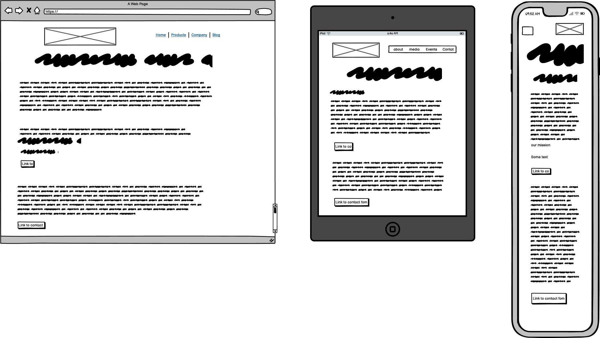

### Blogz Page

Home

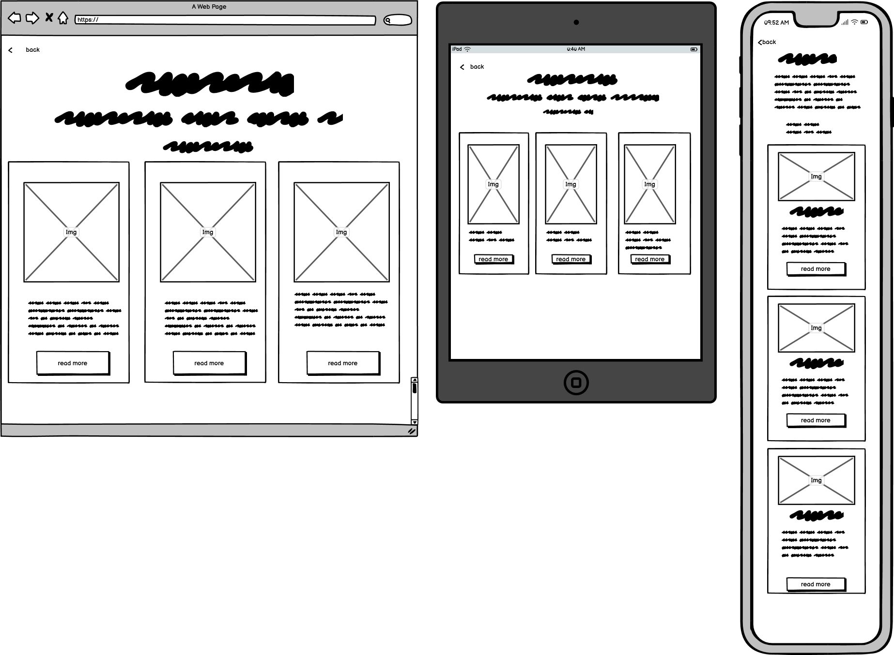

### Contact Page

contact

### Events Page

IEvents

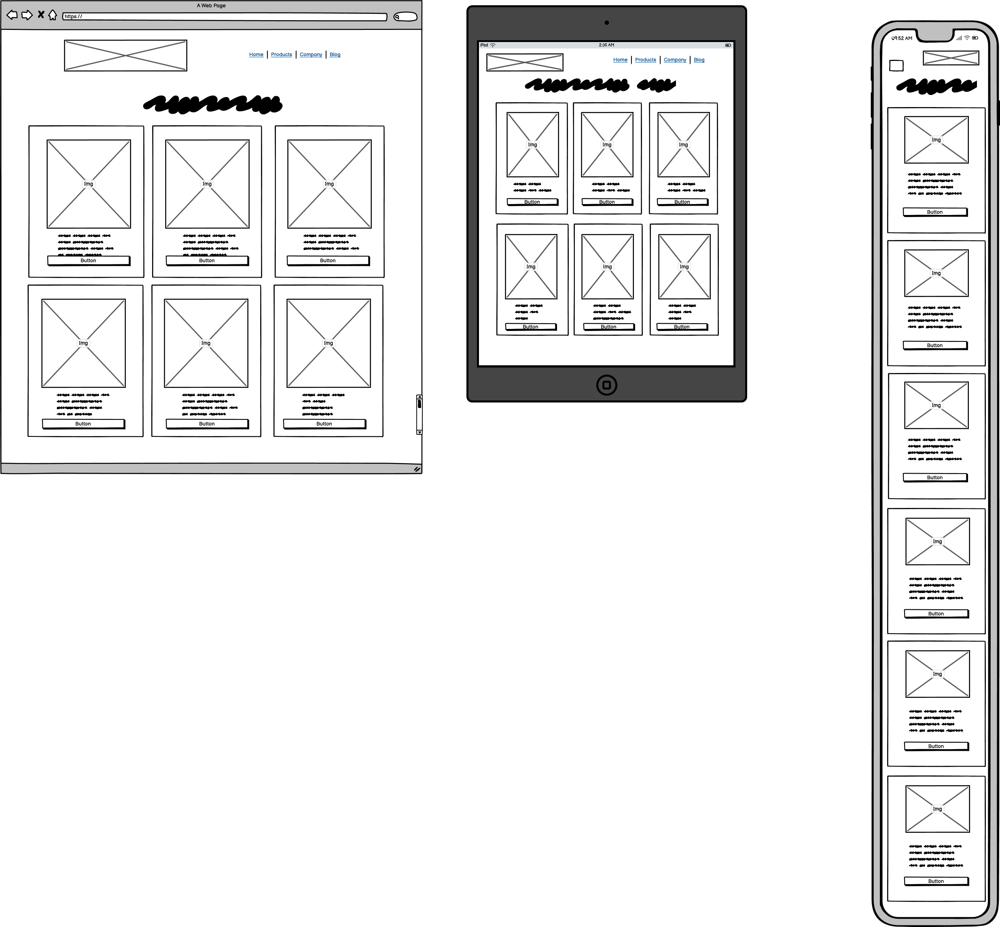

### Video Page

Video

### Media Hub Page

Media

### Music Page

 Music

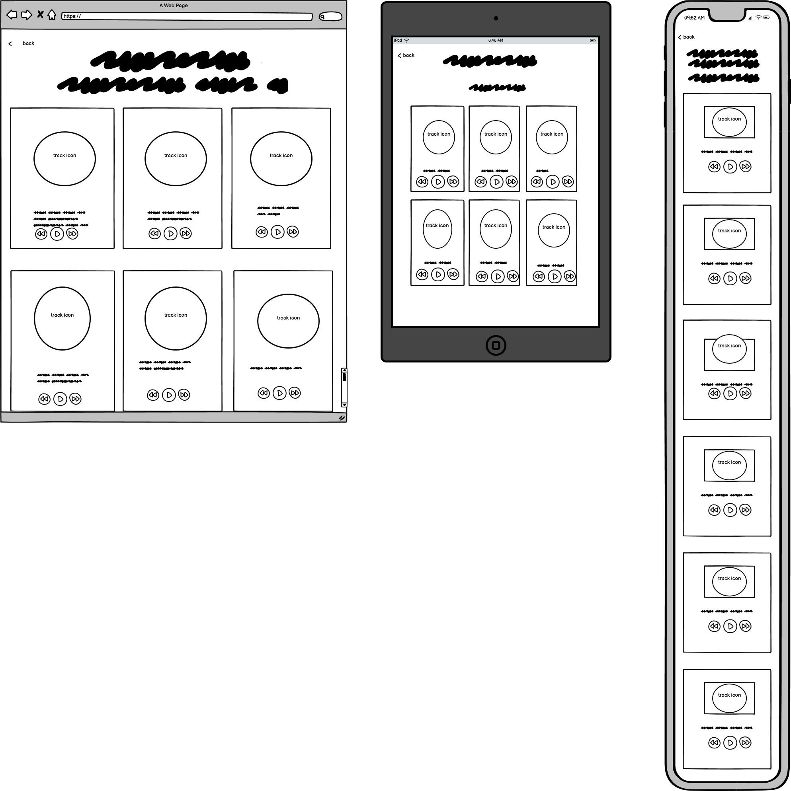

### Video Page

Video

## Technologies Used

### Languages

- HTML5
- CSS3
- JavaScript (ES6+)
- 
### Frameworks & Tools

- Bootstrap 5.3 (CDN)
- Custom CSS (`assets/css/style.css`)
- Google Fonts
- FontAwesome (for icons)
- Git & GitHub for version control
- GitHub Pages for deployment
- WAVE, Lighthouse, W3C Validator for accessibility/validation
-Tinypng
- Balsamiq
- Adobe Color
- Font Awsome
- Favicon.io
---

## Features
The website consists of nine HTML pages, with five main pages featured in the navigation bar.
 
### Logo and Navigation Bar

- The logo and nav bar appear at the top of every page.
- The navigation bar is fully responsive—on smaller screens, it changes to a hamburger menu for mobile usability.
- The navbar includes direct links to the five core pages: Home, About, Events, Media, and Contact.
- This structure allows users to easily find and explore different sections of the site.
- The link for the currently active main page is highlighted in the navigation bar, helping users keep track of where they are.
- The logo itself is clickable and always links back to the Home page, making it simple for users to return to the main section from anywhere on the site.
- User stories covered: This fulfills all navigation-related user stories for easy access on all devices.

### Hero Banner & Mascot Slider (Home)

- Animated hero section with a 3D mascot slider greets users on the home page.
- Fulfills: User Story 4 — gives first-time users a clear sense of mission, vibe, and the site's community focus.

### About Page Story

- Column layout with community roots, platform mission, and a call-to-action.
- Fulfills: User Story 4 — helps users and returning visitors understand the site's values and story.

### Media Hub Grid

- Central page with four interactive tiles for music, gallery, video, and blogs.
- Fulfills: User Story 5 — lets returning users instantly access media and blog content.

### Music Player Cards

- Vinyl-inspired cards with built-in audio players and track/artist info.
- Fulfills: User Story 3 (first-timers can sample music); User Story 5 (returning users can replay tracks).

### Gallery Carousel

- Responsive Bootstrap carousel displays full images with no cropping.
- Fulfills: User Story 3 — lets users view community photos to get the site’s vibe.

### Video Cards

- Embedded, responsive video players with titles, upload dates, and descriptions.
- Fulfills: User Story 3 — lets users watch videos of performances, battles, and tutorials.

### Blog Previews & Modals

- Preview cards open full articles in accessible modals.
- Fulfills: User Story 5 (easy access to blog content for returning users); Admin Story 9 (site owner can easily update content).

### Event Cards & Booking Modals

- Cards display event title, venue, price, and open modals for tickets or artist registration.
- Fulfills: User Story 1 (see upcoming events and locations); User Story 2 (see ticket prices); Admin Story 10 (easy artist and attendee registration).

### Contact Form

- Multi-purpose form with file upload for submissions and integrated Google Map.
- Fulfills: User Story 6 (users can submit feedback/collaborations or songs); User Story 7 (users can get directions via the map).

 and Admin Story 11 (maintains strong, consistent community branding).
- The site’s design and functionality have been successfully tested on both iPhone 5s and iPad Pro.

---

## Testing & Validation

### HTML Validation- All pages validated with [W3C HTML Validator](https://validator.w3.org/)
  - No errors found (custom code only; some 3rd-party libraries may generate benign warnings).

  
Home

  

  
About

  

    

  
Media

  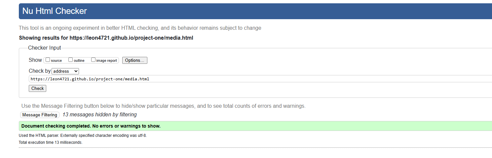

  
Events

  

  
Contact

  

  
Music

  

  
Video

  

  
Gallery

  

  
Blogz

  

### CSS Validation
-

CSS

- Custom CSS validated via 
- No errors, minor warnings for variables
  

### Accessibility Validation

### Accessibility
-The WAVE WebAIM web accessibility evaluation tool was used to ensure the website met high accessibility standards. All pages pass with 0 errors.

  -

Home

about

 

Media

   

Events

Contact

Music

Video

Gallery

Blogz

### Performance
Google Lighthouse in Google Chrome Developer Tools was used to test the performance of the website.

- 

Home

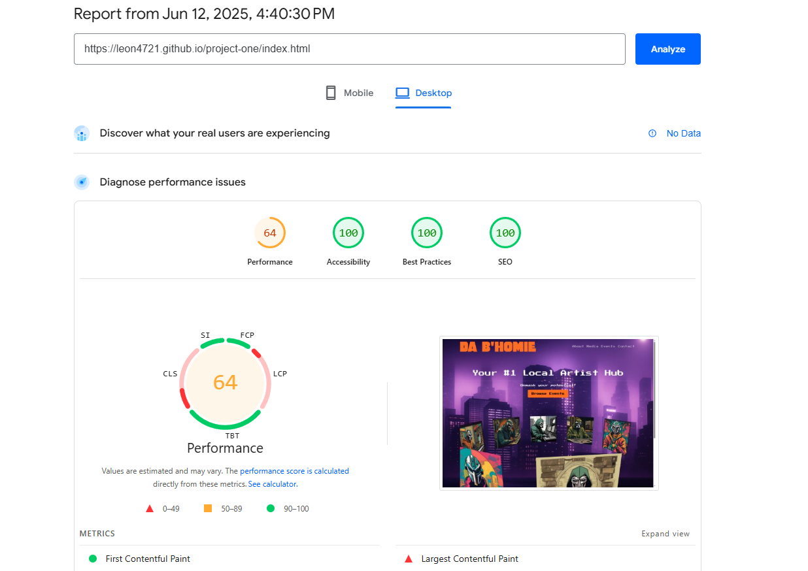

about

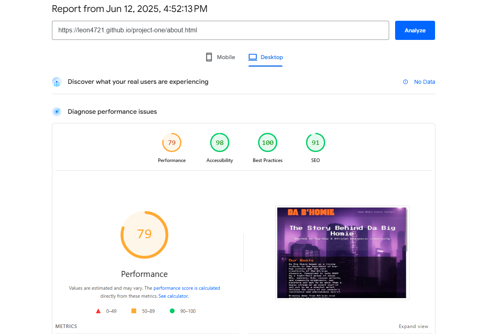

 

Media

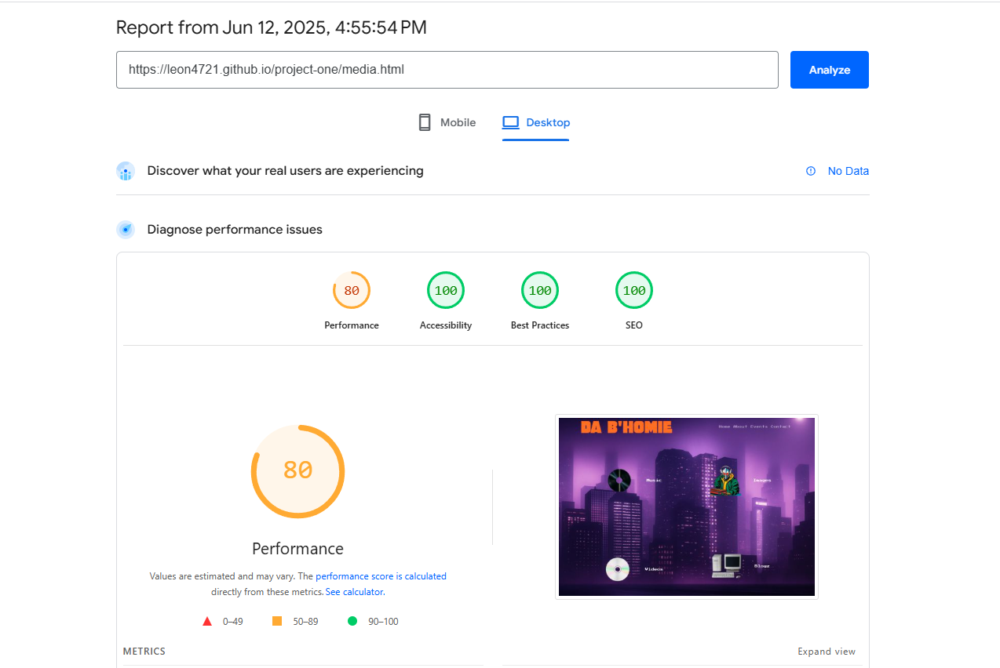

   

Events

Contact

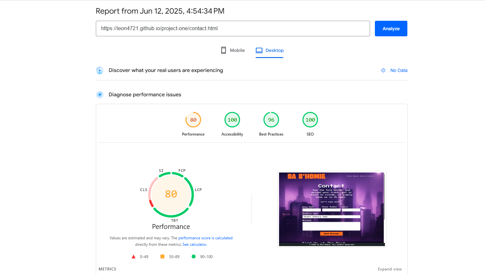

Music

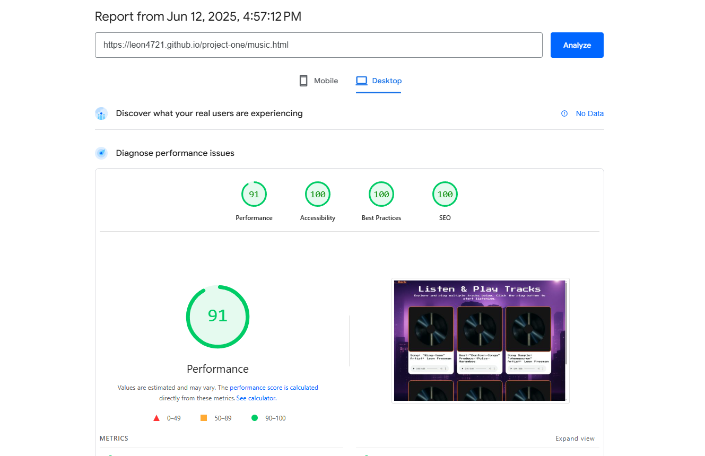

Video

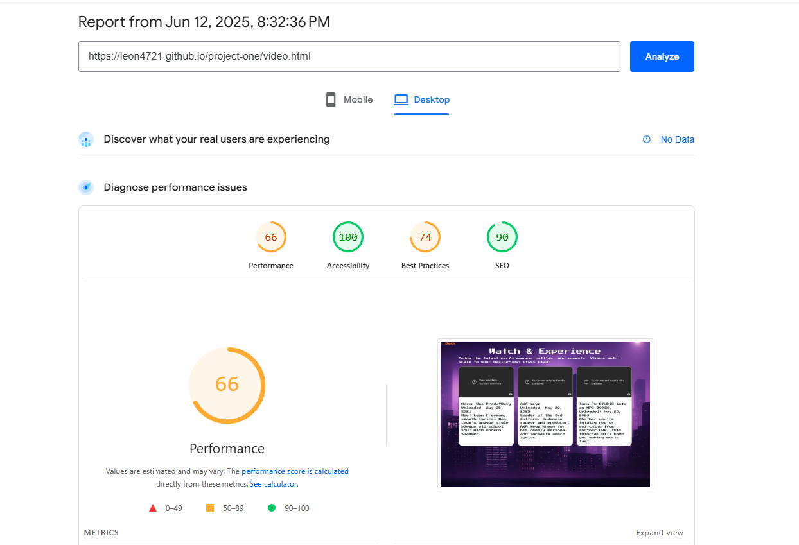

Gallery

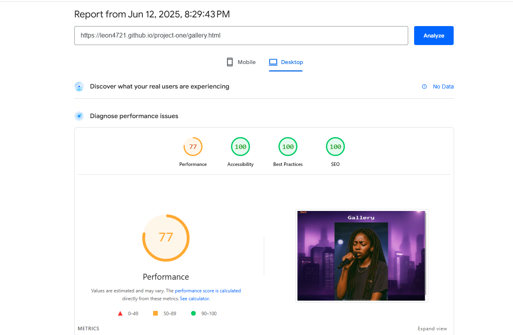

Blogz

    

### Device & Browser Compatibility

Performing tests on various devices
The website was tested on the following devices:
-iphone; 5s, 15, 15 pro max and 16
-samsung S25Ultra
-MetaQuest 3s
-Windows 10 
-Ipad Pro

In addition, the website was tested using Google Chrome Developer Tools Device Toggeling option for all available device options.

### Testing User Stories

| User Story             | Feature/Page          | Action                       | Expected Result                | Actual Result | Screenshot |
|------------------------|----------------------|------------------------------|-------------------------------|---------------|------------|
| See upcoming events    | events.html          | View event cards             | Events displayed               | Pass          | [img ]      |
| RSVP/buy tickets       | events.html          | Use event modal form         | Success modal/confirmation     | Pass          | [img]      |
| Submit music/art       | contact.html         | Upload via form              | Confirmation, reset form       | Pass          | [img]      |
| Browse images/videos   | gallery.html, video.html | Carousel/YouTube embeds    | Content displays/plays         | Pass          | [img]      |
| Contact the team       | contact.html         | Submit contact form          | Success alert, email sent*     | Pass          | [img]      |

-As a first-time user, I want to know where the event or venue is located

Feature	Action	Expected Result	Actual Result
Google Map	Navigate to the Contact page and find the embedded map	View a map showing the venue location	Works as expected
Contact Information	On the Contact page, check the contact info box	See the event or venue address listed	Works as expected

Screenshots
   

As a first-time user, I want to know the price for events

Feature	Action	Expected Result	Actual Result
Event Cards	Go to the Events page and browse event listings	See ticket prices displayed on each event card	Works as expected

Screenshots
  

As a first-time user, I want to know more about Da Big Homie

Feature	Action	Expected Result	Actual Result
About Section	Navigate to the About page	Read about Da Big Homie’s story and mission	Works as expected
Mission & Roots	On the About page, view the "Our Roots" or mission section	See background and platform values	Works as expected

Screenshots
  

As a first-time user, I want to get a feel for what to expect at an event

Feature	Action	Expected Result	Actual Result
Gallery	Navigate to the Gallery page	View photos from past events and community moments	Works as expected
Video Showcase	Go to the Video page and play a performance or battle	Watch highlight clips or artist interviews	Works as expected

Screenshots
   

As a returning user, I want to replay music or see new blog posts

Feature	Action	Expected Result	Actual Result
Music Cards	Go to the Music page and play a track	Listen to music from featured artists	Works as expected
Blogz	Go to the Blogz page and read new articles	Find recent posts and urban stories	Works as expected

Screenshots
   

As a returning user, I want to contact the team or submit my music

Feature	Action	Expected Result	Actual Result
Contact Form	On the Contact page, fill out and submit the form (including file upload for music)	Send a message or song submission	Works as expected

Screenshots
  

As a returning user, I want to get directions to the next event

Feature	Action	Expected Result	Actual Result
Google Map	Go to the Contact page and use the map	Get directions to the venue via Google Maps	Works as expected

Screenshots
  

As a returning user, I want the site to work smoothly on my phone

Feature	Action	Expected Result	Actual Result
Responsive Layout	Visit any page on a mobile device	Navigation, forms, and media adapt to screen size	Works as expected

Screenshots
  

As a site owner, I want users to RSVP or register as artists

Feature	Action	Expected Result	Actual Result
Event Modal Forms	On the Events page, use the "Book Now" or "Artist Register" buttons	Open a modal form for tickets or artist sign-up	Works as expected

Screenshots
  

As a site owner, I want the site branding to stay consistent

Feature	Action	Expected Result	Actual Result
Custom Styling	Browse any page	Colors, fonts, and layout reflect hip-hop/urban theme	Works as expected

Screenshots
  </details
---

## Bugs & Issues

| Bug                               | Fix / Status                |
|------------------------------------|-----------------------------|
| Modal not closing on esc           | Added event listener, fixed |
| Carousel not scaling on iPhone     | Adjusted CSS for 320px min  |
| Navbar active class not switching  | JS patch, fixed             |
| Form submit w/o message possible   | Set `required` attribute    |
| Gallery carousel overflow (tablet) | Media queries added         |

---

## Deployment

1. Pushed project files to GitHub repo ([link](https://github.com/leon4721/project-one))
2. Enabled GitHub Pages in repo settings
3. Site published at: https://leon4721.github.io/project-one/
4. For local development:  
   - Clone repo, open `index.html` in browser
   - All assets are relative; no server needed

## Credits & Attribution

### Images & Media
- All images and artwork are originals Created by Sora AI (leonfreemans creations) unless credited below.

### Code
- Bootstrap components adapted from official documentation.
- Banner slider implementation adapted from Lun Dev’s CSS-only tutorial: "Create Crazy 3D Image Slider Effects Using CSS Only" (YouTube).

### Music & Audio
- All music tracks are original compositions by Leon Freeman and perosnal friends e.g aka keyz, Tev and Chev
- Any embedded media (YouTube) is used with permission or as allowed by platform.

### JavaScript
- All scripts written by Leon Freeman. Any snippets adapted from forums/tutorials are credited in code comments.

### Fonts
- Google Fonts: Press Start 2P

### Acknowledgements
- Thanks to testers, friends,
- 
